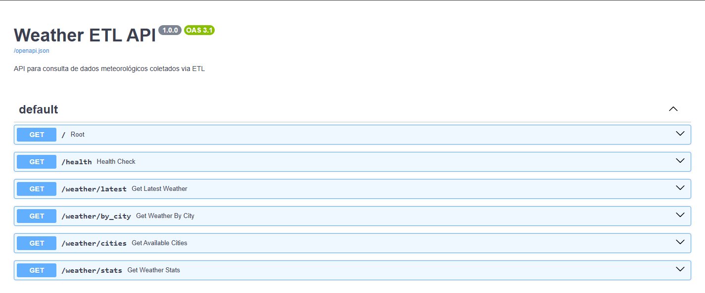

# Weather ETL API


Sistema completo de ETL automatizado para dados meteorológicos com API REST, utilizando Python, FastAPI, PostgreSQL e Docker.



## O projeto

O Weather ETL API é um sistema completo que:

1. **Extrai** dados meteorológicos da API OpenWeatherMap
2. **Transforma** os dados em formato padronizado
3. **Carrega** os dados em banco PostgreSQL
4. **Disponibiliza** os dados via API REST com FastAPI

O sistema é totalmente containerizado com Docker e inclui testes.

## Funcionalidades

### ETL Pipeline
- Extração automática de dados da OpenWeatherMap API
- Transformação e normalização de dados
- Carregamento em PostgreSQL com validação

### API REST
- Endpoint para dados mais recentes (`/weather/latest`)
- Endpoint para busca por cidade (`/weather/by_city`)
- Endpoint para listar cidades disponíveis (`/weather/cities`)
- Endpoint para estatísticas (`/weather/stats`)
- Documentação automática (Swagger/OpenAPI)

### Infraestrutura
- Containerização completa com Docker
- Orquestração com docker-compose
- Banco PostgreSQL com inicialização automática
- Interface web Adminer para administração

### Qualidade
- Testes unitários e de integração com pytest
- Lint com flake8
- Formatação com black e isort


### Para rodar o projeto: 

1. **Clonar repositório**:
   ```bash
   # Navegar para pasta desejada (ex: Desktop)
   cd Desktop
   
   # Clonar o projeto
   git clone https://github.com/fernandabucheri/weather-etl-api.git
   
   # Entrar na pasta do projeto
   cd weather-etl-api
   ```

2. **Configurar Variáveis de Ambiente**:

1. **Criar arquivo .env:**
   ```bash
   # Copiar arquivo de exemplo
   copy .env.example .env
   ```

2. **Editar arquivo .env**:
   - Abra o arquivo `.env`
   - Substitua `your_api_key_here` pela sua chave da OpenWeatherMap
   - Salve o arquivo

   Exemplo:
   ```env
   OPENWEATHER_API_KEY=a1b2c3d4e5f6g7h8i9j0k1l2m3n4o5p6
   ```

3. **Executar o Projeto:**

- Iniciar serviços:
   ```bash
   # Construir e iniciar todos os serviços
   docker-compose up -d
   ```

- Verificar se está funcionando:
   ```bash
   # Verificar status dos containers
   docker-compose ps
   
   # Ver logs
   docker-compose logs -f
   ```

- Aguardar inicialização:
   - Aguarde 2-3 minutos para todos os serviços iniciarem
   - O ETL fará a primeira coleta automaticamente

4. **Testar a API:**

- Abrir navegador e acessar:
   - **API Docs**: http://localhost:8000/docs
   - **Health Check**: http://localhost:8000/health
   - **Dados Recentes**: http://localhost:8000/weather/latest

- Testar endpoints:
   ```bash
   # No PowerShell, testar com curl (se disponível)
   curl http://localhost:8000/health
   ```

### Documentação Interativa

- **Swagger UI**: http://localhost:8000/docs
- **ReDoc**: http://localhost:8000/redoc

### Endpoints Disponíveis

#### 1. Health Check
```http
GET /health
```
Verifica se a API e banco estão funcionando.

**Resposta**:
```json
{
  "status": "healthy",
  "timestamp": "2024-01-01T12:00:00",
  "database_connected": true,
  "version": "1.0.0"
}
```

#### 2. Dados Mais Recentes
```http
GET /weather/latest
GET /weather/latest?city=São Paulo
```
Retorna os dados meteorológicos mais recentes.

**Parâmetros**:
- `city` (opcional): Nome da cidade

**Resposta**:
```json
{
  "id": 1,
  "city_name": "São Paulo",
  "country_code": "BR",
  "temperature": 25.5,
  "humidity": 65,
  "pressure": 1013,
  "weather_main": "Clear",
  "weather_description": "céu limpo",
  "wind_speed": 3.5,
  "data_timestamp": "2024-01-01T12:00:00"
}
```

#### 3. Dados por Cidade
```http
GET /weather/by_city?city=São Paulo
GET /weather/by_city?city=São Paulo&limit=5
```
Retorna histórico de dados para uma cidade.

**Parâmetros**:
- `city` (obrigatório): Nome da cidade
- `limit` (opcional): Número de registros (1-100, padrão: 10)

**Resposta**:
```json
[
  {
    "id": 1,
    "city_name": "São Paulo",
    "temperature": 25.5,
    "humidity": 65,
    "data_timestamp": "2024-01-01T12:00:00"
  }
]
```

#### 4. Cidades Disponíveis
```http
GET /weather/cities
```
Lista todas as cidades com dados disponíveis.

**Resposta**:
```json
["São Paulo", "Rio de Janeiro", "Belo Horizonte"]
```

#### 5. Estatísticas
```http
GET /weather/stats
```
Retorna estatísticas gerais dos dados.

**Resposta**:
```json
{
  "total_records": 1000,
  "total_cities": 5,
  "average_temperature": 25.5,
  "cities": [
    {
      "name": "São Paulo",
      "record_count": 500,
      "avg_temperature": 24.0
    }
  ]
}
```

## Resultados - Jupyter Notebook

📓 O arquivo [`jupyter notebook/Notebook_RESULTADOS.ipynb`](jupyter%20notebook/Notebook_RESULTADOS.ipynb) contém um notebook que extrai dados da API e plota gráficos com os resultados obtidos.
